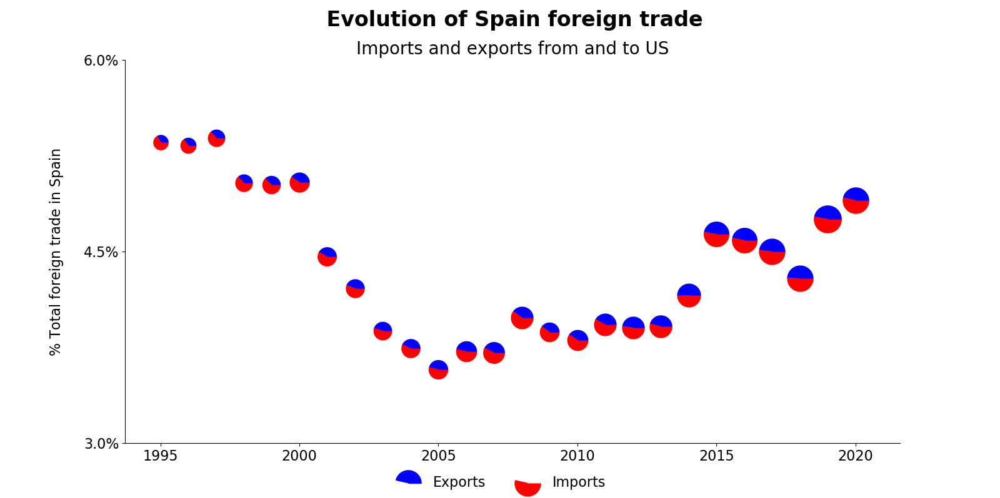
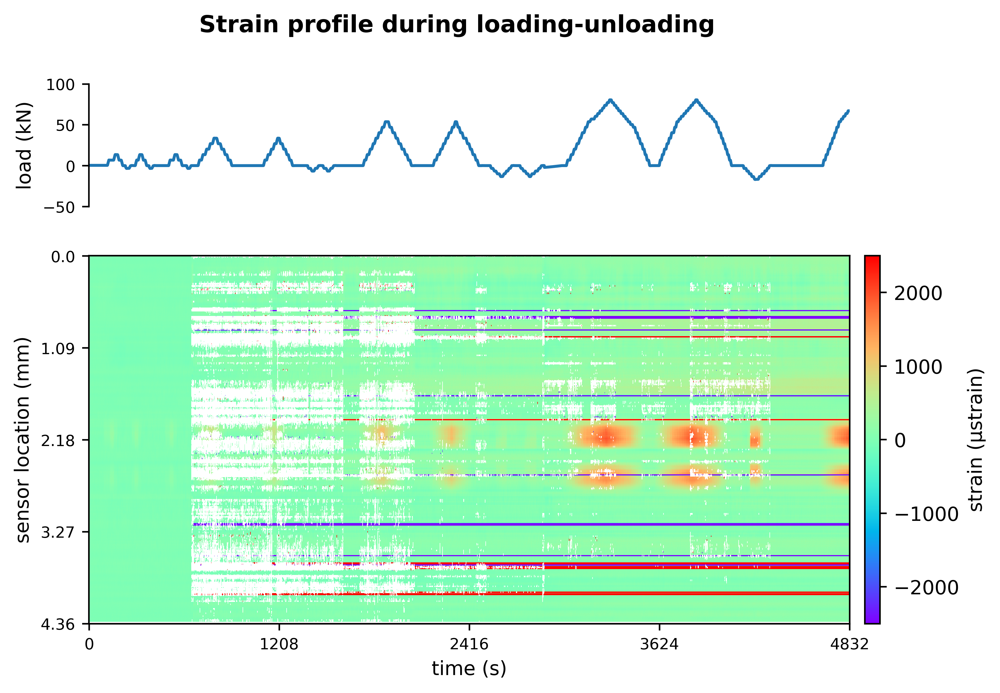

# Examples of data visualization using Python

## Spain/US trading evolution 

The data used in the following graph was extracted from [ICEX][1] and [Datacomex][2].

This graph condenses the following information:
 * Percentage of Spain trade with US relative to the total foreing trade in Spain as a function of time (x and y axes, respectively)
 * Volume of money involved in the trade (circle size)
 * Proportion of import vs export (proportion of red and blue in the circles)

From the graph it is seen that the trading volume between US and Spain has increased with time. It must be pointed out that it is not corrected by inflation. Spain used to import more than it expoerted to the US. However, this changed through time and now exports and imports are balanced. From a Spanish point of view, the importance of trade with the US has been steadily increasing from an all-time low in 2005.

[1]:https://www.icex.es/icex/es/navegacion-principal/todos-nuestros-servicios/informacion-de-mercados/paises/navegacion-principal/el-pais/relaciones-bilaterales/index.html?idPais=US
[2]:https://datacomex.comercio.es/Data/Index

## Mechanical tests

Sensors are placed along a specimen and loading-unloading cycles are applied. To visualize the specimen deformation (strain) upon loading, the following plot was generated.

Load peaks (top graph) coincide with strain peaks in two central areas of the specimen (red zones in bottom graph). In the first part of the test, many sensors failed to acquire data (white regions). Throughout the test, some sensors got stuck in over-compressed or over-stretched values (red and blue horizontal lines).
